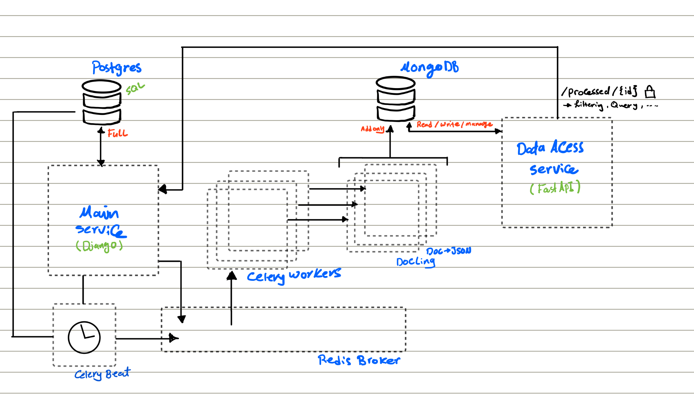
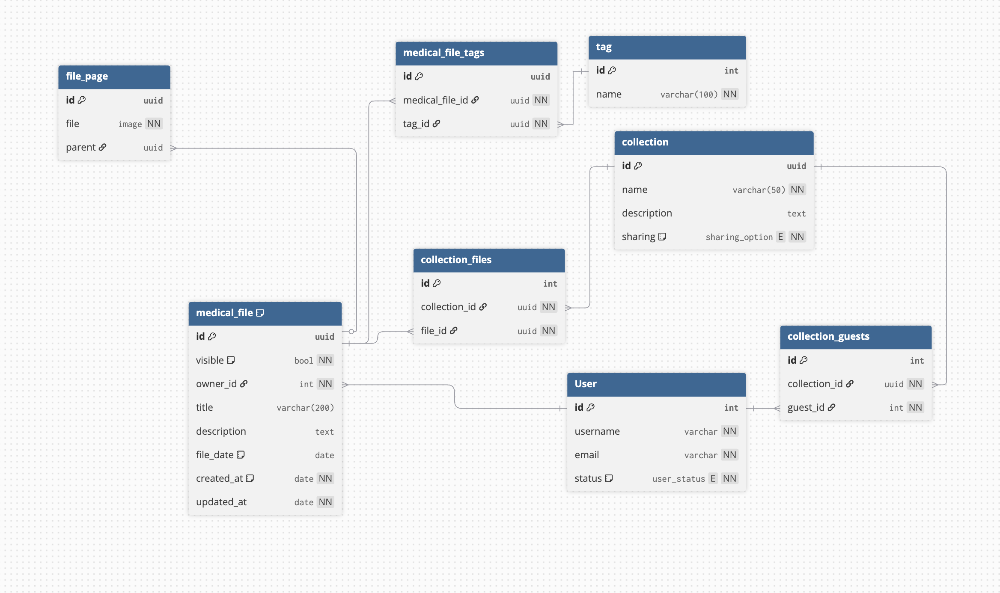

# Medical Tracker

## System Design

### Main Service

## End Points

`/med` [ListCreateAPIView](https://www.django-rest-framework.org/api-guide/generic-views/#listcreateapiview) perm is owner (nested with tags)

`/med/<pk>` [RetrieveUpdateDestroyAPIView](https://www.django-rest-framework.org/api-guide/generic-views/#retrieveupdatedestroyapiview) is owner

`/med/search` [SearchFilter](https://www.django-rest-framework.org/api-guide/filtering/#searchfilter)

`/<username>/collections`

`/<username>/collections/<pk>`
``

/profile

### Caching

- Medical Files For Specific User
